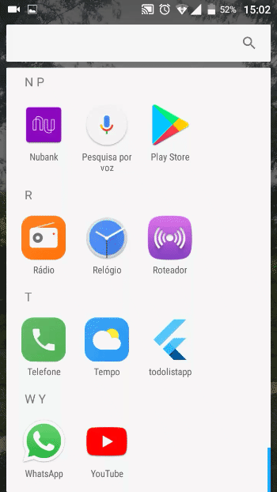

# TODO List - Flutter

<p align="center"></p>

O apk está diposnível na versão [v0.1-alpha](https://github.com/Barbalho12/todolist-flutter/releases/download/v0.1-alpha/app-release.apk) 

### Dependêcnias

* [todolist-backend](https://github.com/Barbalho12/todolist-backend) - Backend do sistema
* [Git](https://git-scm.com/downloads)
* [Android Studio](https://developer.android.com/studio/install)
* [Flutter](https://flutter.dev/docs/get-started/install)


### Executando localmente

Clone o projeto
```bash
git clone https://github.com/Barbalho12/todolist-flutter.git
```

Acesse o diretório do projeto
```bash
cd todolist-flutter
```

Veja os passos para execução no VS code no [Tutorial](https://flutter.dev/docs/get-started/test-drive?tab=vscode)

> **Observação em ambiente local:** configure corretamente o endereço do backend em `lib/api.dart`

### Outros Projetos

- [Backend](https://github.com/Barbalho12/todolist-backend)
- [React](https://github.com/Barbalho12/todolist-spa)
